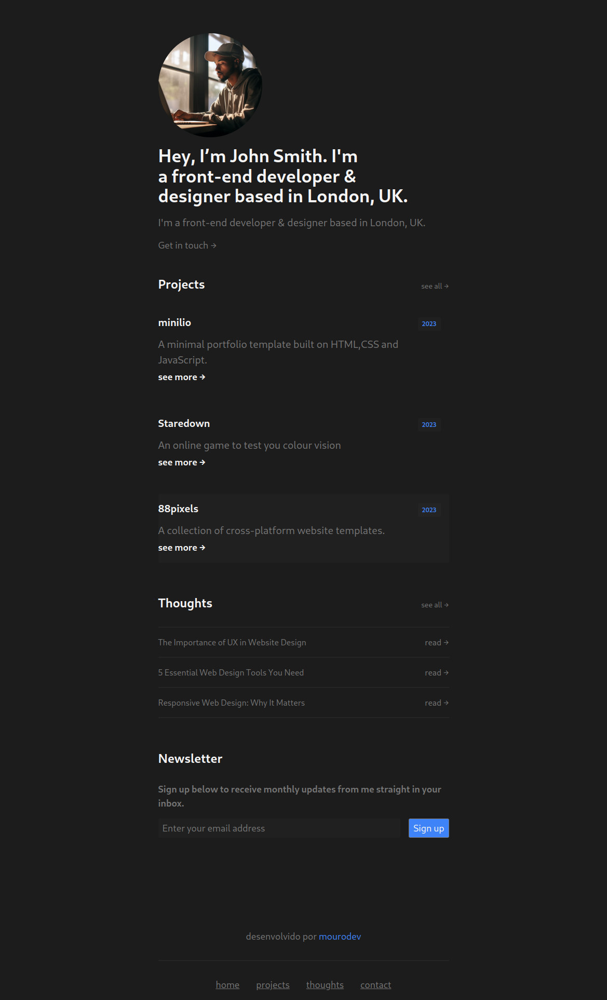
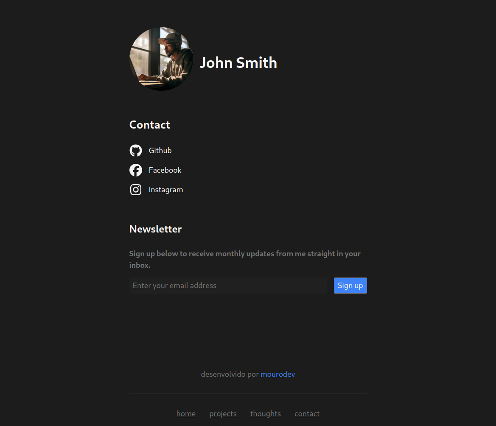

# Mini Portfolio

O Mini Portfolio é um projeto pessoal que desenvolvi para demonstrar minhas habilidades em design web e desenvolvimento front-end. Ele é uma coleção de páginas web interativas e responsivas, criadas com HTML, CSS.

## Visualização

  
  

## Recursos Principais:

- **Layout Responsivo:** O Mini Portfolio é totalmente responsivo e se adapta a diferentes dispositivos e tamanhos de tela, proporcionando uma experiência consistente em desktops, tablets e smartphones.

- **Design Moderno:** Utilizando princípios de design moderno, o Mini Portfolio apresenta uma estética limpa e elegante, com elementos visuais atraentes e uma paleta de cores harmoniosa.

- **Portfólio de Projetos:** O projeto inclui uma seção de portfólio onde posso exibir meus trabalhos e projetos mais recentes. Cada projeto é apresentado de forma atraente, com imagens, descrições e links para mais detalhes.

- **Contato Interativo:** Os visitantes podem entrar em contato comigo facilmente pelas redes sociais. Isso me permite receber mensagens e feedbacks dos usuários de forma conveniente.

## Como Usar:

1. **Clone o Repositório:** Faça o clone deste repositório em sua máquina local usando o comando `git clone`.

2. **Abra o Arquivo Index.html:** Após clonar o repositório, navegue até a pasta do projeto e abra o arquivo `index.html` em seu navegador web para visualizar o Mini Portfolio.

## Contribuição:

Contribuições são bem-vindas! Se você tiver sugestões de melhorias, novos recursos ou encontrar algum problema, sinta-se à vontade para abrir uma issue ou enviar um pull request.
